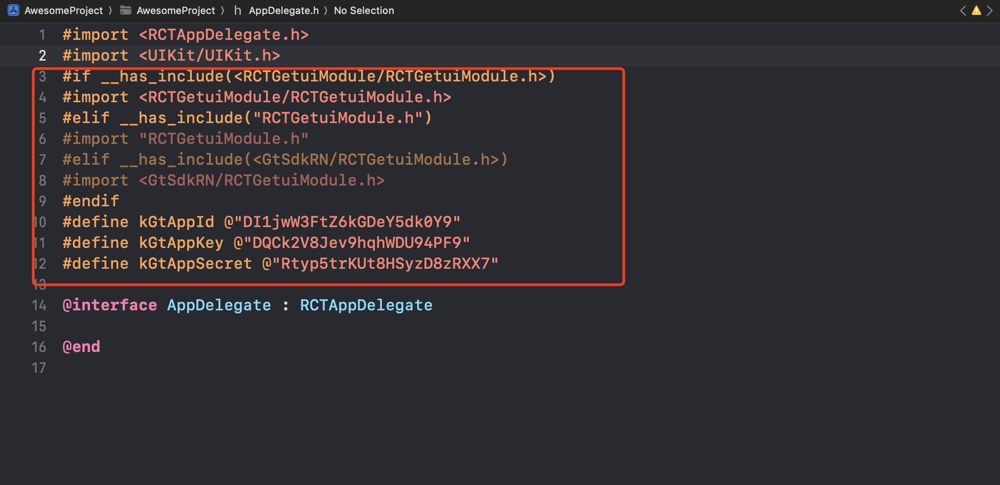
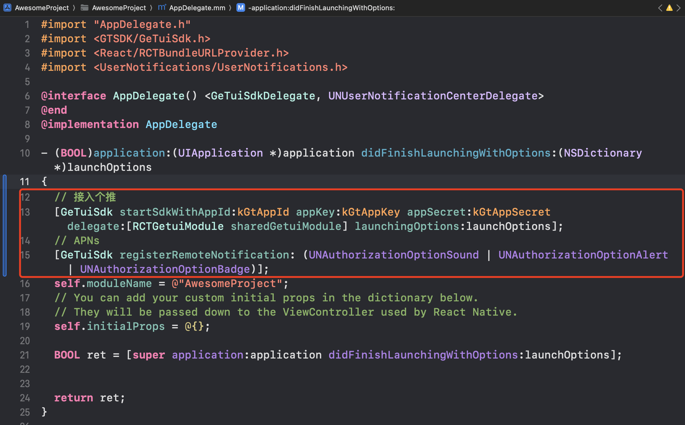

# react-native-getui 
* react-native-getui 是个推官方开发的 React Native 插件，使用该插件可以方便快速地集成推送功能。

* 多厂商版本请联系技术支持


# 环境

1. React Native Version 
   "react": "18.3.1"
   "react-native": "0.75.4"
2. 当前react-native-getui版本 1.1.55


注意：
- react-native 版本>=0.76，建议使用插件版本>=1.1.54
- 插件版本1.1.53 是expo App定制版本。


# 1.安装

### 1.1 使用 npm 自动安装

在您的项目根目录下执行

````js
step1:添加npm包依赖
 npm install react-native-getui@latest --save 


step2:iOS, pod项目, 链接iOS原生代码
npx pod-install


step2: 链接 (非Autolinking项目, 和iOS非pod项目)
react-native link

step3: 自动添加GTSDK配置代码
npm run GetuiConfigure <yourAppId> <yourAppKey> <yourAppSecret>  <yourModuleName>

//yourModuleName 指的是你的 Android 项目中的模块名称（对 iOS 没有影响，不填写的话默认值为 app）
npm run GetuiConfigure DI1jwW3FtZ6kGDeY5dk0Y9 DQCk2V8Jev9hqhWDU94PF9 Rtyp5trKUt8HSyzD8zRXX7 app

````

## 1.2 示例

* 新版本插件[AndroidDemo](https://github.com/GetuiLaboratory/react-native-getui/tree/master/example/AndroidDemo)

* iOS 最新[参考Demo](https://github.com/GetuiLaboratory/react-native-getui/tree/master/example/IosDemo)


# 2. 配置

* yourAppId  yourAppKey   yourAppSecret  需要去 [个推官网](https://dev.getui.com) 注册后，在后台配置获取。


## 2.1 Android

* 使用step3: 自动添加GTSDK配置代码后, AndroidManifest.xml自动生成配置

  ```xml
  <manifest>
   <application>
  		  <meta-data android:name="PUSH_APPID" android:value="你的appid"/>
          <meta-data android:name="PUSH_APPKEY" android:value="你的appkey"/>
          <meta-data android:name="PUSH_APPSECRET" android:value="你的appSecret"/>
     </application>
  </manifest>
  ```

  没有的话, 需要自己添加

* 默认不混淆, 如果开启了混淆
  将插件中proguard.txt的内容, 复制到Android工程的proguard-rules.pro中
  ```txt
    -keep class com.igexin.** { *; }
    -keep class com.getui.gtc.** {*;}
    //如果接入厂商,查看proguard.txt
  ```


## 2.2 IOS

### 2.2.1 使用step3: 自动添加GTSDK配置代码后,

* Appdelegate.h 自动生成配置

  ```objective-c
  #if __has_include(<RCTGetuiModule/RCTGetuiModule.h>)
  #import <RCTGetuiModule/RCTGetuiModule.h>
  #elif __has_include("RCTGetuiModule.h")
  #import "RCTGetuiModule.h"
  #elif __has_include(<GtSdkRN/RCTGetuiModule.h>)
  #import <GtSdkRN/RCTGetuiModule.h>
  #endif
  #define kGtAppId @"DI1jwW3FtZ6kGDeY5dk0Y9"
  #define kGtAppKey @"DQCk2V8Jev9hqhWDU94PF9"
  #define kGtAppSecret @"Rtyp5trKUt8HSyzD8zRXX7"
  ```

* Appdelegate.m 的didFinishLaunchingWithOptions中自动生成代码

  ```objective-c
   // 接入个推
  [GeTuiSdk startSdkWithAppId:kGtAppId appKey:kGtAppKey appSecret:kGtAppSecret delegate:[RCTGetuiModule sharedGetuiModule] launchingOptions:launchOptions];
  
   // APNs
  [GeTuiSdk registerRemoteNotification: (UNAuthorizationOptionSound | UNAuthorizationOptionAlert | UNAuthorizationOptionBadge)];  
  ```

没有的话, 需要自己添加


### 2.2.2 使用CocoaPods安装 

如果是原生应用集成react-native

如果你的 React Native 是通过 Cocoapods 来集成的则使用下面两个步骤来集成 

1. 在Podfile中添加如下代码（需要写在对应的 target 里）：

````
pod 'GtSdkRN', :path => '../node_modules/react-native-getui'
````

2. 终端执行如下命令：

````
pod install
````

**注意:** 

*  使用 pod 就不要使用 react-native link 了，不然会有冲突。

* 在 iOS 工程中如果找不到头文件可能要在 TARGETS-> BUILD SETTINGS -> Search Paths -> Header Search Paths 添加如下如路径

  ```
  $(SRCROOT)/../node_modules/react-native-getui/ios/RCTGetuiModule
  ```

  

## 2.3 手动安装

 替换 step3: 自动添加GTSDK配置代码手动安装

* [Xcode 工程配置](https://github.com/GetuiLaboratory/react-native-getui/blob/master/document/iOS.md)
* [Android Studio 工程配置](https://github.com/GetuiLaboratory/react-native-getui/blob/master/document/android.md)

**注意:** 

* 在 iOS 工程中如果找不到头文件需要在 TARGETS-> BUILD SETTINGS -> Search Paths -> Header Search Paths 添加如下如路径：

  ```
  $(SRCROOT)/../node_modules/react-native-getui/ios/RCTGetuiModule
  ```

* 因新版本功能修改，需要添加“libresolv.tbd”库


### 2.4 API调用与订阅消息

查看示例

android 与 ios 有部分API不同, 查看插件的index.js 或 index.d.ts中API的注释


## 3.iOS注意事项

项目需要打开通知能力，才能获取DeviceToken用于通知展示点击等业务。Xcode打开工程,Signing & Capabilities中添加Push Notification和Background Modes如下：


上述GetuiConfigure指令会在AppDelegate中插入初始化GTSDK代码，具体如下：






## 4 ohos
查看文档 [README.md](react-native-harmony-push/README.md)