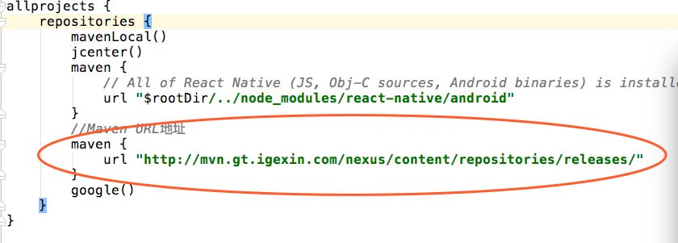
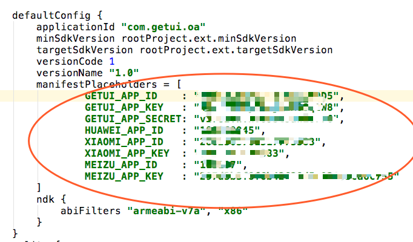
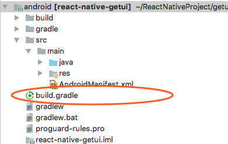

## React-native多厂商版本集成

RN多厂商版本采用maven引入的方式

需要在android/build.gradle添加maven地址,如下图所示

需要在app module和react-native-getui module中修改build.gradle配置 如下。

你配置的包名 appid appkey appsecret 等

Android/app/build.gradle

React-native-getui module 中的build.gradle 配置与上面相同

